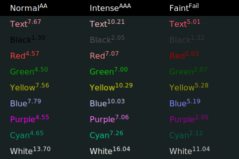

# Aquamarine

*WIP*

This is my attempt to create an accessible color scheme for the terminals I use, [Konsole](https://konsole.kde.org/) and [Windows Terminal](https://github.com/Microsoft/Terminal).

<p align="center"></p>

## How to use

### Konsole

* Place `Aquamarine.colorscheme` in `~/.local/share/konsole/`.
* In *Konsole*, click the **☰** menu in the top right corner, *Edit Current Profile…*, then *Appearance* on the left, and select *Aquamarine*.

### Windows Terminal

* In *Windows Terminal*, click **⌄** on the tab bar, and then click *Settings*.
* Click *Open JSON file* in the bottom left corner.
* Copy everything from `WindowsTerminal.json` to the end of the `"schemes"` block. Remember that blocks in the JSON file must be separated by commas, like this:
````
"schemes":
    [
        {
            "name": "previous one"
        },
        {
            "name": "Aquamarine"
        }
    ],
````
* Then you can set *Aquamarine* in the file itself (look for `"colorScheme"`), or do it in the GUI for a specific profile or as default.

## Accessible how?

Contrast, mostly. I just took base colors (blue, red, purple, etc.) and adjusted them using [ColorShark](https://colorshark.io).

## What about color blindness?

I am color blind, but one scheme will not work for everyone. I have adjusted color pairs that give me trouble (yellow/green, cyan/white, etc.), which should work for some people.

## Why “Aquamarine”?

This is one of the colors I changed significantly to get away from white and light gray. Otherwise it should be cyan. Then in [Nushell](https://www.nushell.sh/), which I use, you type with that color, so it felt as good a name as any.